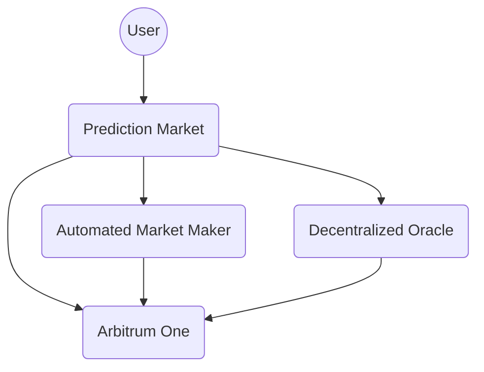

# How it Works

Myriad Prediction Market is a system constructed out of three parts.

- Prediction Market - The main user interface of the system.
- Automated Market Maker (AMM) - A decentralized exchange mechanism that facilitates trading.
- Oracle - A service that provides external data to the blockchain to resolve market outcomes.

At its highest level, the system context of Myriad Prediction Market can be viewed like this:

